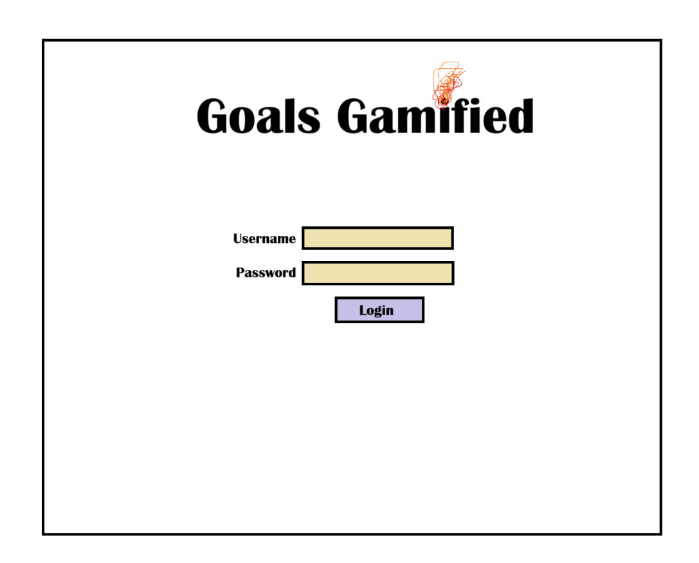
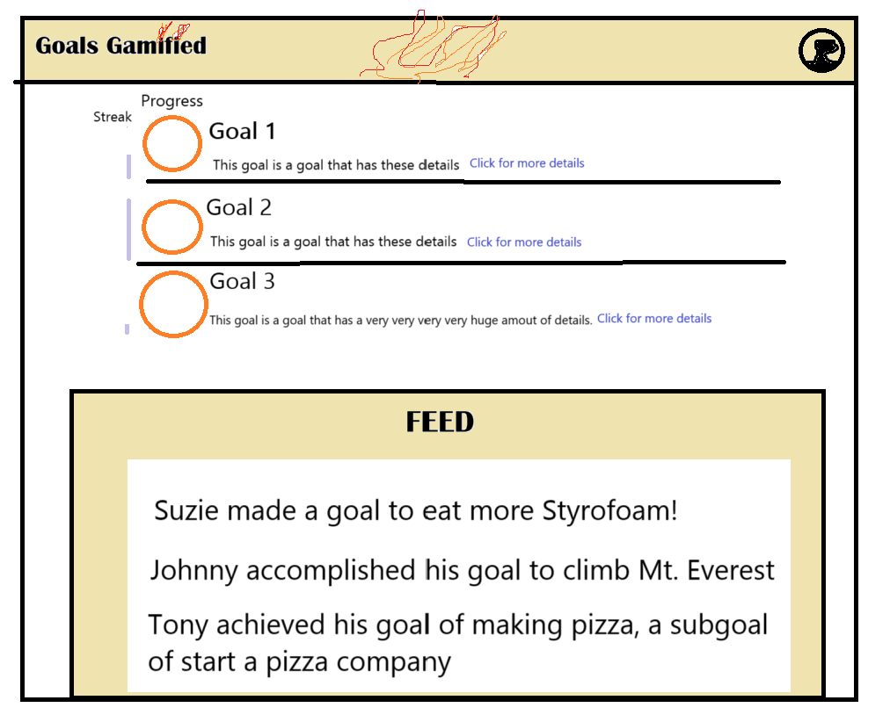
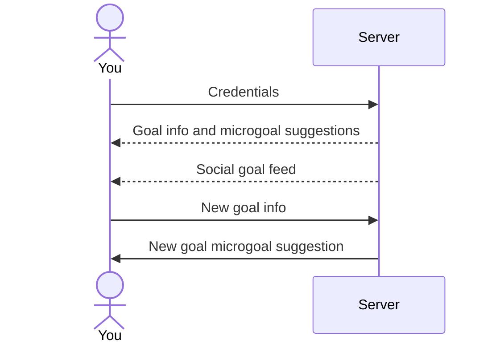
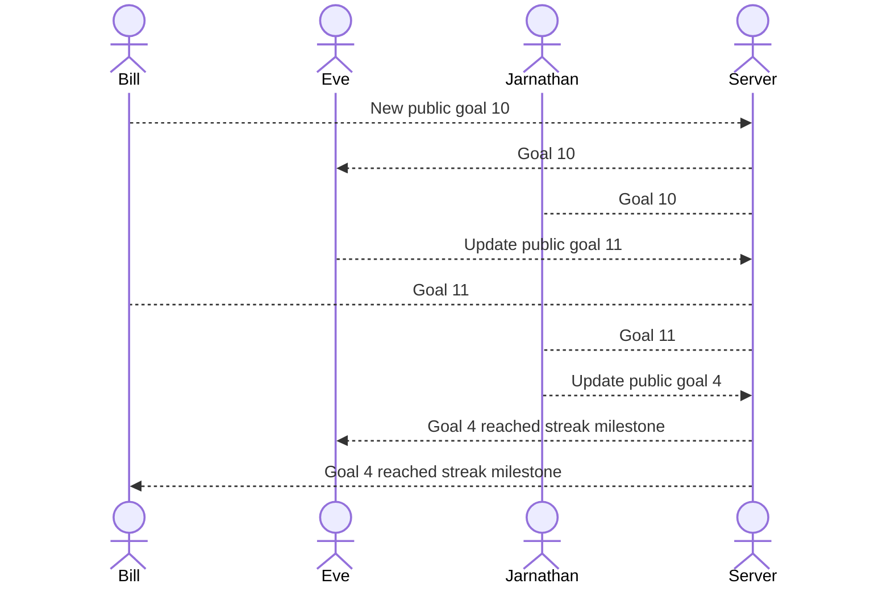

# Goals Gamified

[My Notes](notes.md)

This website is a simple, gamified goal tracker with social media motivational features, goal suggestions, 
and text reminders.

# Note
>  **This project is currently in progress and is on track to complete at the end of Winter semester, 2025 (April).**
> 
## 🚀 Specification Deliverable

### The following is rough draft of the website I will construct this semester:

For this deliverable I did the following.

- [x] Proper use of Markdown
- [x] A concise and compelling elevator pitch
- [x] Description of key features
- [x] Description of how you will use each technology
- [x] One or more rough sketches of your application. Images must be embedded in this file using Markdown image references.

### Elevator pitch

The start of a new year is a new chance to improve ourselves, to try again. Often its hard to keep up the motivation to exercise, 
journal, or serve others. More immediately pleasurable activities often take their place such as sleeping in, playing video games, 
or watching Disney+. The goal-tracking site makes it easy to keep up motivation, by combining the immediate pleasure of games and 
social media with long term success. Easy to use, it suggests mini goals to keep up momentum. 
It keeps track of streaks and helps you keep up motivation by creating a social feed of inspiration.

### Design

#### Login page:

#### Login page:

#### Sequence diagram of logging in and adding a goal:

#### Sequence diagram of social goal feed system

### Key features

- Ability to input, delete, edit, and nest goals
- Ability to track daily progress towards goals
- HTTPS login
- Visual display of progress towards goals, accomplished goals, and streaks
- Ability to store goal and progress info
- A feed of other users' pulic goals and accomplished goals/microgoals
- Integrates with ai (ChatGPT) with microgoal suggestions (to maintain motivation)
- Ability to send goal reminders on mobile

### Technologies

I am going to use the required technologies in the following ways.

- **HTML** - Uses properly formatted HTML. Has 2 HTML pages: A login page and a goal setting/tracking page 
with embedded feed.
- **CSS** - Formatting works well for PC and mobile sized browsers. Uses good color contrast and palette as well as text font, 
prioritizing readability and professionalism. Display feed and goal progress bars.
- **React** - Runs login. Runs goal display, goal input GUI, and alters progress and streak meters. Sends requests 
to and receives data from backend for goals, progress, streaks, and microgoal suggestions. Displays feed 
and settings as reactive components of the goal setting page. 
- **Service** - The backend provides a goal feed endpoint, login and retrieve goals endpoint, update goals endpoint, 
delete goals endpoint, ChatGPT API-integrated microgoal suggestion endpoint, user creation endpoint, 
and update user settings endpoint. Backend also integrates with SMS API.
- **DB/Login** - DB requires authentication to access user info (except public "posts" for the feed). Stores 
user credentials and goal info securely. Is accessed by backend service.
- **WebSocket** - Social goal feed is received live from the server.

## 🚀 AWS deliverable

For this deliverable I did the following.

- [x] **Server deployed and accessible with custom domain name** - [benjaminlingwall.com](https://benjaminlingwall.com).

## 🚀 HTML deliverable

For this deliverable I did the following. I checked the box `[x]` and added a description for things I completed.

- [ ] **HTML pages** - I did not complete this part of the deliverable.
- [ ] **Proper HTML element usage** - I did not complete this part of the deliverable.
- [ ] **Links** - I did not complete this part of the deliverable.
- [ ] **Text** - I did not complete this part of the deliverable.
- [ ] **3rd party API placeholder** - I did not complete this part of the deliverable.
- [ ] **Images** - I did not complete this part of the deliverable.
- [ ] **Login placeholder** - I did not complete this part of the deliverable.
- [ ] **DB data placeholder** - I did not complete this part of the deliverable.
- [ ] **WebSocket placeholder** - I did not complete this part of the deliverable.

## 🚀 CSS deliverable

For this deliverable I did the following. I checked the box `[x]` and added a description for things I completed.

- [ ] **Header, footer, and main content body** - I did not complete this part of the deliverable.
- [ ] **Navigation elements** - I did not complete this part of the deliverable.
- [ ] **Responsive to window resizing** - I did not complete this part of the deliverable.
- [ ] **Application elements** - I did not complete this part of the deliverable.
- [ ] **Application text content** - I did not complete this part of the deliverable.
- [ ] **Application images** - I did not complete this part of the deliverable.

## 🚀 React part 1: Routing deliverable

For this deliverable I did the following. I checked the box `[x]` and added a description for things I completed.

- [ ] **Bundled using Vite** - I did not complete this part of the deliverable.
- [ ] **Components** - I did not complete this part of the deliverable.
- [ ] **Router** - Routing between login and voting components.

## 🚀 React part 2: Reactivity

For this deliverable I did the following. I checked the box `[x]` and added a description for things I completed.

- [ ] **All functionality implemented or mocked out** - I did not complete this part of the deliverable.
- [ ] **Hooks** - I did not complete this part of the deliverable.

## 🚀 Service deliverable

For this deliverable I did the following. I checked the box `[x]` and added a description for things I completed.

- [ ] **Node.js/Express HTTP service** - I did not complete this part of the deliverable.
- [ ] **Static middleware for frontend** - I did not complete this part of the deliverable.
- [ ] **Calls to third party endpoints** - I did not complete this part of the deliverable.
- [ ] **Backend service endpoints** - I did not complete this part of the deliverable.
- [ ] **Frontend calls service endpoints** - I did not complete this part of the deliverable.

## 🚀 DB/Login deliverable

For this deliverable I did the following. I checked the box `[x]` and added a description for things I completed.

- [ ] **User registration** - I did not complete this part of the deliverable.
- [ ] **User login and logout** - I did not complete this part of the deliverable.
- [ ] **Stores data in MongoDB** - I did not complete this part of the deliverable.
- [ ] **Stores credentials in MongoDB** - I did not complete this part of the deliverable.
- [ ] **Restricts functionality based on authentication** - I did not complete this part of the deliverable.

## 🚀 WebSocket deliverable

For this deliverable I did the following. I checked the box `[x]` and added a description for things I completed.

- [ ] **Backend listens for WebSocket connection** - I did not complete this part of the deliverable.
- [ ] **Frontend makes WebSocket connection** - I did not complete this part of the deliverable.
- [ ] **Data sent over WebSocket connection** - I did not complete this part of the deliverable.
- [ ] **WebSocket data displayed** - I did not complete this part of the deliverable.
- [ ] **Application is fully functional** - I did not complete this part of the deliverable.

## Testing
Testing
testing even more from github's console
