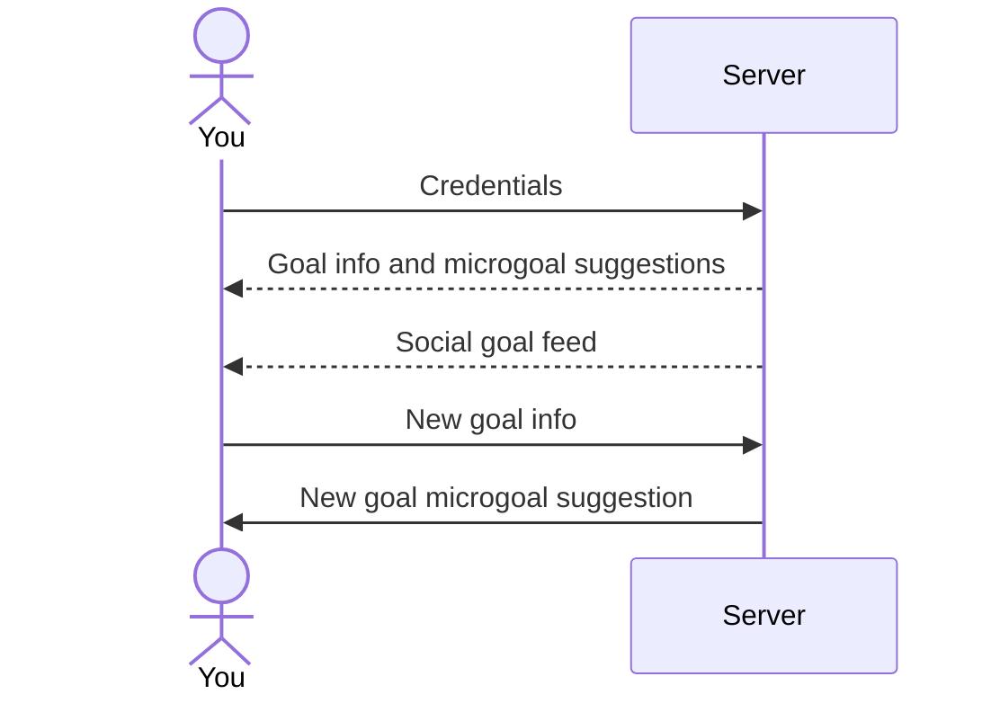
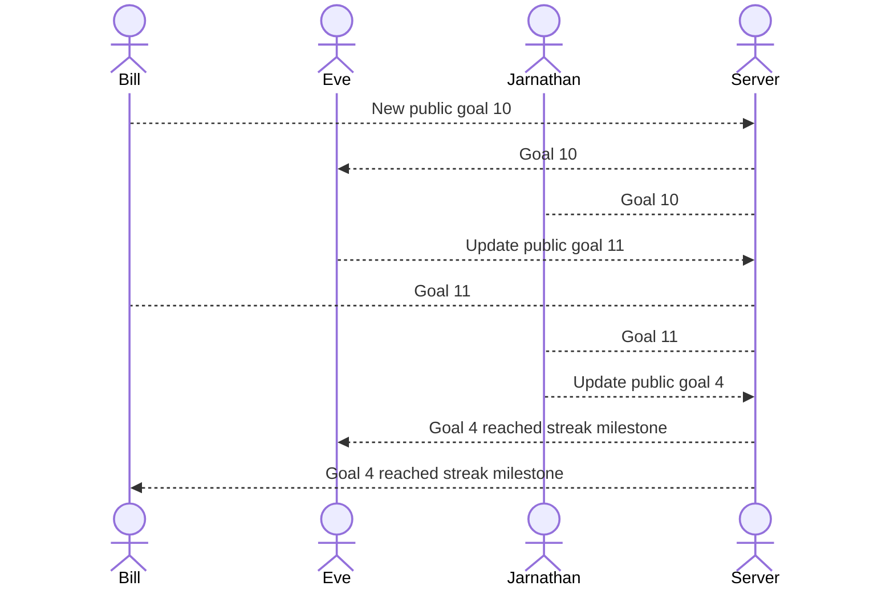

# Goals Gamified

[My Class Notes](notes.md)

This website is a simple, gamified goal tracker with social media motivational features, goal suggestions, 
and text reminders.

# Note
**This project is currently in progress and is on track to complete at the end of Winter semester, 2025 (April).**

## 🚀 Specification Deliverable

### The following is rough draft of the website I will construct this semester:

For this deliverable I did the following.

- [x] Proper use of Markdown
- [x] A concise and compelling elevator pitch
- [x] Description of key features
- [x] Description of how you will use each technology
- [x] One or more rough sketches of your application. Images must be embedded in this file using Markdown image references.

### Elevator pitch

The start of a new year is a new chance to improve ourselves, to try again. Often its hard to keep up the motivation to exercise, 
journal, or serve others. More immediately pleasurable activities often take their place such as sleeping in, playing video games, 
or watching Disney+. The goal-tracking site makes it easy to keep up motivation, by combining the immediate pleasure of games and 
social media with long term success. Easy to use, it suggests mini goals to keep up momentum. 
It keeps track of streaks and helps you keep up motivation by creating a social feed of inspiration.

### Design

#### Login page:

#### Login page:

#### Sequence diagram of logging in and adding a goal:

#### Sequence diagram of social goal feed system

### Key features

- Ability to input, delete, edit, and nest goals
- Ability to track daily progress towards goals
- HTTPS login
- Visual display of progress towards goals, accomplished goals, and streaks
- Ability to store goal and progress info
- A feed of other users' pulic goals and accomplished goals/microgoals
- Integrates with ai (ChatGPT) with microgoal suggestions (to maintain motivation)
- Ability to send goal reminders on mobile

### Technologies

I am going to use the required technologies in the following ways.

- **HTML** - Uses properly formatted HTML. Has 2 HTML pages: A login page and a goal setting/tracking page 
with embedded feed.
- **CSS** - Formatting works well for PC and mobile sized browsers. Uses good color contrast and palette as well as text font, 
prioritizing readability and professionalism. Display feed and goal progress bars.
- **React** - Runs login. Runs goal display, goal input GUI, and alters progress and streak meters. Sends requests 
to and receives data from backend for goals, progress, streaks, and microgoal suggestions. Displays feed 
and settings as reactive components of the goal setting page. 
- **Service** - The backend provides a goal feed endpoint, login and retrieve goals endpoint, update goals endpoint, 
delete goals endpoint, ChatGPT API-integrated microgoal suggestion endpoint, user creation endpoint, 
and update user settings endpoint. Backend also integrates with SMS API.
- **DB/Login** - DB requires authentication to access user info (except public "posts" for the feed). Stores 
user credentials and goal info securely. Is accessed by backend service.
- **WebSocket** - Social goal feed is received live from the server.

## 🚀 AWS deliverable

For this deliverable I did the following.

- [x] **Server deployed and accessible with custom domain name** - [benjaminlingwall.com](https://benjaminlingwall.com).

## 🚀 HTML deliverable

For this deliverable I did the following. I checked the box `[x]` and added a description for things I completed.

- [x] **HTML pages** - I created 4 pages. 2 are only intended to be embedded in iframes. 1 page is for logins. 1 page is for a goals main display. 1 page is for personal goals (embedded). 1 page is for live feed of others' public goals.
- [x] **Proper HTML element usage** - I properly used HTML, including svg, input, form, iframe, and img elements.
- [x] **Links** - I created navigation links in the header, placeholder javascript links such as "more details" and "edit" in personal goals, and a GitHub link. The login button links to the goals page.
- [x] **Text** - I added a lot of placeholder text, labels, and headings. This includes personal goal text, text about others' goal milestones, and text pulled from a 3rd party API (as "Goal Suggestions").
- [x] **3rd party API placeholder** - I added a placeholder for ChatGPT api feature (Called "Goal Suggestions").
- [x] **Images** - I created flame pngs/icons as well as a checkmark png. I edited a CC0 profile icon and found a CC0 thumbsup icon. All of these have been integrated into the site. I also created several progress bar/circle svgs.
- [x] **Login placeholder** - I created a form with username and password inputs on the index page.
- [x] **DB data placeholder** - The iframe with the personal goals listed represents data pulled from and sent to the DB.
- [x] **WebSocket placeholder** - The "Feed" iframe represents data pulled live from the server.

## 🚀 CSS deliverable

For this deliverable I did the following. I checked the box `[x]` and added a description for things I completed.

- [x] **Header, footer, and main content body** - I styled these area's margins, background color, font size, layout using flex, and more using CSS stylesheet and bootstrap.
- [x] **Navigation elements** - I used flex to change navigation to a row layout. Used bootstrap to style navigation buttons and make profile icon more professional. I used bootstrap to increase the contrast of the links.
- [x] **Responsive to window resizing** - I used bootstraps container-fluid to make the content responsive as well as the @media selector to make the table legible at smaller widths. (The iframes must be resized dynamically with JavaScript)
- [x] **Application elements** - Used good spacing and clean icons to make the elements clearly understandable. Used bootstrap to ensure buttons had good contrast and were visually pleasing.
- [x] **Application text content** - Resized text and text white to be easier to read, and more visually pleasing.
- [x] **Application images** - Ensured my applications logo was included with good formatting inline with the header. Replaced the placeholder icons with better ones from bootstrap. Replaced streak svg with progress bar from Bootstrap, altered with overriding CSS to be upright. Ensured the streak indicator and progress loop svg had good spacing.

## 🚀 React part 1: Routing deliverable

For this deliverable I did the following. I checked the box `[x]` and added a description for things I completed.

- [x] **Bundled using Vite** - I used vite to bundle the code and loaded it to the server
- [x] **Components** - I created App, Login, Goals, and NotFound components.
- [x] **Router** - My index.jsx routes between Login, Goals, and NotFound within the App component.

## 🚀 React part 2: Reactivity

For this deliverable I did the following. I checked the box `[x]` and added a description for things I completed.

- [x] **All functionality implemented or mocked out** - Yes. Functionality implemented/mocked out includes, ChatGPT goal suggestions, storage, deletion, and editing of goals. Streak tracking. Feed for other's goal milestones. Login functionality. Dynamically hiding and showing goal editors. 
- [x] **Hooks** - I used useState to keep track of goal metadata, update goals dynamically, keep track of goal suggestions, and keep track of feed data.
I used useEffect to dynamically update goals, feed, goal suggestions, and goal metadata.

## 🚀 Service deliverable

For this deliverable I did the following. I checked the box `[x]` and added a description for things I completed.

- [ ] **Node.js/Express HTTP service** - I did not complete this part of the deliverable.
- [ ] **Static middleware for frontend** - I did not complete this part of the deliverable.
- [ ] **Calls to third party endpoints** - I did not complete this part of the deliverable.
- [ ] **Backend service endpoints** - I did not complete this part of the deliverable.
- [ ] **Frontend calls service endpoints** - I did not complete this part of the deliverable.

## 🚀 DB/Login deliverable

For this deliverable I did the following. I checked the box `[x]` and added a description for things I completed.

- [ ] **User registration** - I did not complete this part of the deliverable.
- [ ] **User login and logout** - I did not complete this part of the deliverable.
- [ ] **Stores data in MongoDB** - I did not complete this part of the deliverable.
- [ ] **Stores credentials in MongoDB** - I did not complete this part of the deliverable.
- [ ] **Restricts functionality based on authentication** - I did not complete this part of the deliverable.

## 🚀 WebSocket deliverable

For this deliverable I did the following. I checked the box `[x]` and added a description for things I completed.

- [ ] **Backend listens for WebSocket connection** - I did not complete this part of the deliverable.
- [ ] **Frontend makes WebSocket connection** - I did not complete this part of the deliverable.
- [ ] **Data sent over WebSocket connection** - I did not complete this part of the deliverable.
- [ ] **WebSocket data displayed** - I did not complete this part of the deliverable.
- [ ] **Application is fully functional** - I did not complete this part of the deliverable.

## Testing
Testing
testing even more from github's console
